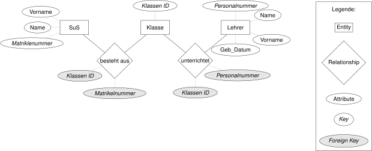

# Einführung in Datenbanken

Die Einführung in Datenbanken basiert auf dem Einführungskapitel aus dem Buch
Abraham Silberschatz, Henry F. Korth und S. Sudarshan; Database system
concepts; Seventh edition; New York 2020.

## Einführung

Die bisher besprochenen Datenstrukturen dienen der Bearbeitung von Daten im
Arbeitsspeicher. Sie sind daher auf einen beschränkten Umfang von Datensätzen
ausgelegt. Ausserdem dienen sie nicht der permanenten Ablage von Daten.

Datenbanken dienen der effizienten Speicherung und Verwaltung
von grossen Datenmengen und der dauerhaften sicheren Speicherung der Daten.

## Charakteristika von Datenbanken

Ein wichtiges Merkmal von Datenbanken ist es, dass die gespeicherten Daten nur
einmal abgelegt werden. Damit kann verhindert werden, dass redundante Daten
lediglich an einer Stelle modifiziert werden und damit Widersprüche entstehen.
Der Entwurf von Datenbanken muss dem Rechnung tragen. Ein Hilfsmittel für den
Entwurf von Datenbanken ist das ER-Diagramm (Entity-Relationship-Diagramm).
Das ER-Diagramm ist eine grafische Darstellung der Datenbankstruktur. Es zeigt
die Entitäten, die in der Datenbank gespeichert werden, mit ihren Attributen
sowie die Beziehungen zwischen den Entitäten. Die untenstehende Graphik zeigt
eine Skizze eines ER-Diagramms, in welchem die Beziehungen zwischen Schülern,
Klassen und Lehrern dargestellt wird.



Das ER-Diagramm kann um eine zusätzliche Entität `Fach` erweitert werden und
sieht dann folgendermassen aus:


Diese Grafiken können in Datenbanktabellen übersetzt werden. Für das Beispiel
werden Tabellen für die Entitäten `Klasse`, `Fach` und `Lehrer` erstellt.	

Die Einfachste Tabelle ist die Tabelle `Klasse`. Sie enthält lediglich ein
Attribut.


Etwas umfangreicher sind die Tabellen `Fach` und `Lehrer`. Sie enthalten jeweils
drei bzw. vier Attribute.

<div style="display: flex; justify-content: space-between;align-items: flex-start;">
    
    
</div>

## Abfrage von Daten

Datenbanken werden mit einer spezifischen Datenbanksprache angesprochen. Im
Gegensatz zur bisher im Unterricht verwendeten Programmiersprache Python ist die
Datenbanksprache SQL (Structured Query Language) eine deklarative Sprache. Das heisst,
dass die Datenbank nicht mit einem Algorithmus angesprochen wird, sondern mit
einer Abfrage, die beschreibt, welche Daten benötigt werden. Die Datenbank
entscheidet dann, wie die Abfrage am besten ausgeführt wird.

Abfragen mit SQL folgen untenstehender Grundstruktur:

```sql
SELECT <Spalten> 
FROM <Tabelle> 
WHERE <Bedingung>;
```

Die Anfrage, welche Lehrer vor dem Jahr 1800 geboren sind, sieht in SQL
folgendermassen aus:

```sql
SELECT Name, Vorname, Geburtsdatum
FROM Lehrer
WHERE Geburtsdatum < '1800-01-01'
ORDER BY Geburtsdatum;
```

Die `SELECT`-Anweisung wählt die Spalten `Name`, `Vorname` und `Geburtsdatum`
zur Anzeige aus. Die `FROM`-Anweisung gibt an, aus welcher Tabelle die Daten
ausgelesen werden. Die `WHERE`-Anweisung gibt die Bedingung an, dass nur
Lehrer angezeigt werden, die vor dem Jahr 1800 geboren sind. Die `ORDER BY`-Option
sorgt dafür, dass die Daten nach dem Geburtsdatum aufsteigend sortiert werden.

Basierend auf den Beispieldaten werden folgende Lehrer zurückgegeben:

| Name     | Vorname                | Geburtsdatum |
|----------|------------------------|--------------|
| Schiller | Friedrich             | 10.11.1759   |
| Gauss    | Johann Carl Friedrich | 30.04.1777   |
| Dufour   | Guillaume-Henri       | 15.09.1787   |
| Balzac   | Honoré de             | 20.05.1799   |

