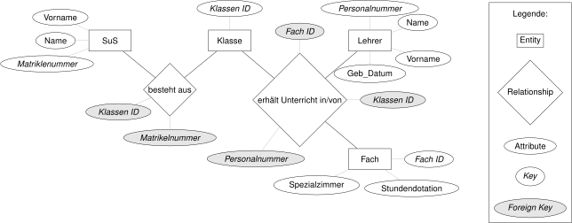

# Einführung in Datenbanken

Die Einführung in Datenbanken basiert auf dem Einführungskapitel aus dem Buch
Abraham Silberschatz, Henry F. Korth und S. Sudarshan; Database system
concepts; Seventh edition; New York 2020.

## Einführung

Die bisher besprochenen Datenstrukturen 
[Dictionary](241120/dictionaries.md),
[Stack, Queue](250122/speicherstrukturen.md)
und [Binary Search Tree](250115/binary_search_tree.md)
dienen der Bearbeitung von Daten im
Arbeitsspeicher. Sie sind daher auf einen beschränkten Umfang von Datensätzen
ausgelegt. Ausserdem dienen sie nicht der permanenten Ablage von Daten.

Im Gegensatz dazu dienen Datenbanken der dauerhaften Ablage grosser Datensätze.
Darüber hinaus sollen sie die effiziente Verfügbarkeit und die Integrität der
Daten sicherstellen.

## Charakteristika von Datenbanken

Ein wichtiges Merkmal von Datenbanken ist es, dass die gespeicherten Daten nur
einmal abgelegt werden. Damit kann verhindert werden, dass redundante Daten
lediglich an einer Stelle modifiziert werden und damit Widersprüche entstehen.
Der Entwurf von Datenbanken muss dem Rechnung tragen. Ein Hilfsmittel für den
Entwurf von Datenbanken ist das ER-Diagramm (Entity-Relationship-Diagramm).
Das ER-Diagramm ist eine grafische Darstellung der Datenbankstruktur. Es zeigt
die Entitäten, die in der Datenbank gespeichert werden, mit ihren Attributen
sowie die Beziehungen zwischen den Entitäten. Die untenstehende Graphik zeigt
eine Skizze eines ER-Diagramms, in welchem die Beziehungen zwischen Schülern,
Klassen und Lehrern dargestellt wird.

Das ER-Diagramm kann um eine zusätzliche Entität `Fach` erweitert werden und
sieht dann folgendermassen aus:

Diese Grafiken können in Datenbanktabellen übersetzt werden. Für das Beispiel
werden Tabellen für die Entitäten `Klasse`, `Fach` und `Lehrer` erstellt.	

Die Einfachste Tabelle ist die Tabelle `Klasse`. Sie enthält lediglich ein
Attribut.

Etwas umfangreicher sind die Tabellen `Fach` und `Lehrer`. Sie enthalten jeweils
drei bzw. vier Attribute.

    
    

Im Folgenden Abschnitt sollen die Daten aus den Tabellen mit Hilfe von SQL
Statements abgefragt werden.